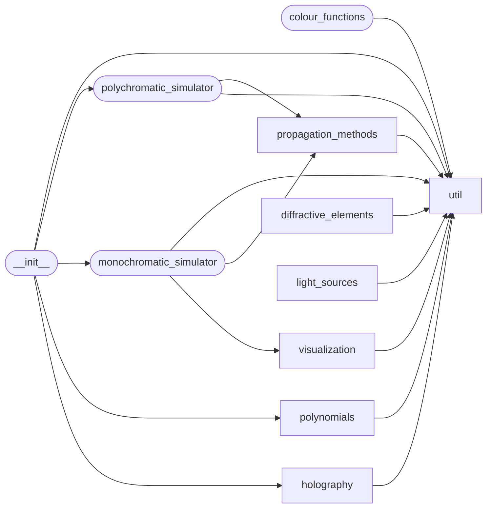

# Code Overview

[_Documentation generated by Documatic_](https://www.documatic.com)

<!---Documatic-section-Codebase Structure Python-start--->
## Codebase Structure Python

The codebase has a single-depth folder structure,
                with 46 code files in total.

<!---Documatic-block-system_architecture-start--->

<!---Documatic-block-system_architecture-end--->

# #
<!---Documatic-section-Codebase Structure Python-end--->

<!---Documatic-section-Key Objects-start--->
## Key Objects

There are exposed imports at level-0
from the source directory (diffractsim)

<!---Documatic-block-diffractsim-start--->

	
<code>diffractsim</code> (Click to Expand!)

* `diffractsim.holography.custom_phase_retrieval.CustomPhaseRetrieval`
* `diffractsim.holography.fourier_phase_retrieval.FourierPhaseRetrieval`
* `diffractsim.monochromatic_simulator.MonochromaticField`
* `diffractsim.polychromatic_simulator.PolychromaticField`
* `diffractsim.polynomials.zernike_polynomials.zernike_polynomial`
* `diffractsim.util.backend_functions.backend`
* `diffractsim.util.backend_functions.get_backend`
* `diffractsim.util.backend_functions.set_backend`
* `diffractsim.util.constants.W`
* `diffractsim.util.constants.cm`
* `diffractsim.util.constants.m`
* `diffractsim.util.constants.mm`
* `diffractsim.util.constants.nm`
* `diffractsim.util.constants.um`

<!---Documatic-block-diffractsim-end--->

# #
<!---Documatic-section-Key Objects-end--->

<!---Documatic-section-Important Functions-start--->
## Important Functions

<!---Documatic-block-important_funcs-start--->
<!---Documatic-block-most_used_funcs-start--->
### Most Utilised Functions

* diffractsim.util.backend_functions.backend (67 times)
* diffractsim.util.constants.cm (8 times)
* diffractsim.util.constants.m (8 times)
* diffractsim.util.constants.mm (8 times)
* diffractsim.util.constants.nm (8 times)
* diffractsim.util.constants.um (8 times)
* [diffractsim.util.scaled_FT.scaled_fourier_transform](8-diffractsim_util.md#diffractsim.util.scaled_FT.scaled_fourier_transform) (4 times)
* diffractsim.propagation_methods.PSF_convolution.apply_transfer_function (3 times)
* [diffractsim.util.bluestein_FFT.bluestein_fft2](8-diffractsim_util.md#diffractsim.util.bluestein_FFT.bluestein_fft2) (3 times)
* [diffractsim.util.bluestein_FFT.bluestein_fftfreq](8-diffractsim_util.md#diffractsim.util.bluestein_FFT.bluestein_fftfreq) (3 times)
* [diffractsim.visualization.plot_longitudinal_profile.plot_longitudinal_profile_colors](6-diffractsim_visualization.md#diffractsim.visualization.plot_longitudinal_profile.plot_longitudinal_profile_colors) (2 times)
* [diffractsim.visualization.plot_longitudinal_profile.plot_longitudinal_profile_intensity](6-diffractsim_visualization.md#diffractsim.visualization.plot_longitudinal_profile.plot_longitudinal_profile_intensity) (2 times)
* [diffractsim.polynomials.zernike_polynomials.zernike_polynomial](5-diffractsim_polynomials.md#diffractsim.polynomials.zernike_polynomials.zernike_polynomial) (2 times)
* [diffractsim.util.image_handling.rescale_img_to_custom_coordinates](8-diffractsim_util.md#diffractsim.util.image_handling.rescale_img_to_custom_coordinates) (2 times)
* [diffractsim.util.file_handling.load_graymap_image_as_array](8-diffractsim_util.md#diffractsim.util.file_handling.load_graymap_image_as_array) (2 times)
* [diffractsim.util.file_handling.save_phase_mask_as_image](8-diffractsim_util.md#diffractsim.util.file_handling.save_phase_mask_as_image) (2 times)
* [diffractsim.util.backend_functions.get_backend](8-diffractsim_util.md#diffractsim.util.backend_functions.get_backend) (1 times)
* [diffractsim.util.backend_functions.set_backend](8-diffractsim_util.md#diffractsim.util.backend_functions.set_backend) (1 times)
* [diffractsim.util.image_handling.convert_graymap_image_to_hsvmap_image](8-diffractsim_util.md#diffractsim.util.image_handling.convert_graymap_image_to_hsvmap_image) (1 times)
* [diffractsim.visualization.plot_colors.plot_colors](6-diffractsim_visualization.md#diffractsim.visualization.plot_colors.plot_colors) (1 times)
* [diffractsim.visualization.plot_intensity.plot_intensity](6-diffractsim_visualization.md#diffractsim.visualization.plot_intensity.plot_intensity) (1 times)
* [diffractsim.visualization.plot_phase.plot_phase](6-diffractsim_visualization.md#diffractsim.visualization.plot_phase.plot_phase) (1 times)
* [diffractsim.visualization.complex_to_rgba.complex_to_rgba](6-diffractsim_visualization.md#diffractsim.visualization.complex_to_rgba.complex_to_rgba) (1 times)
* diffractsim.propagation_methods.angular_spectrum_method.angular_spectrum_method (1 times)
* diffractsim.propagation_methods.two_steps_fresnel_method.two_steps_fresnel_method (1 times)
<!---Documatic-block-most_used_funcs-end--->

<!---Documatic-block-end_user_funcs-start--->
### End User Exposed Functions

* [diffractsim.holography.fourier_phase_retrieval.FourierPhaseRetrieval](9-diffractsim_holography.md#diffractsim.holography.fourier_phase_retrieval.FourierPhaseRetrieval)
* diffractsim.util.constants.nm
* diffractsim.util.constants.mm
* diffractsim.util.constants.m
* [diffractsim.util.backend_functions.set_backend](8-diffractsim_util.md#diffractsim.util.backend_functions.set_backend)
* [diffractsim.holography.custom_phase_retrieval.CustomPhaseRetrieval](9-diffractsim_holography.md#diffractsim.holography.custom_phase_retrieval.CustomPhaseRetrieval)
* diffractsim.polychromatic_simulator.PolychromaticField
* diffractsim.util.backend_functions.backend
* diffractsim.monochromatic_simulator.MonochromaticField
* diffractsim.util.constants.cm
* diffractsim.util.constants.um
* diffractsim.util.constants.W
* [diffractsim.util.backend_functions.get_backend](8-diffractsim_util.md#diffractsim.util.backend_functions.get_backend)
* [diffractsim.polynomials.zernike_polynomials.zernike_polynomial](5-diffractsim_polynomials.md#diffractsim.polynomials.zernike_polynomials.zernike_polynomial)
<!---Documatic-block-end_user_funcs-end--->
<!---Documatic-block-important_funcs-end--->

# #
<!---Documatic-section-Important Functions-end--->

<!---Documatic-section-File IO-start--->
## File IO

<!---Documatic-block-file_io-start--->
The following files have file read operations

<!---Documatic-block-diffractsim-start--->

	
<code>diffractsim</code> (Click to Expand!)

* diffractsim.colour_functions

<!---Documatic-block-diffractsim-end--->

<!---Documatic-block-diffractsim.diffractive_elements-start--->

	
<code>diffractsim.diffractive_elements</code> (Click to Expand!)

* diffractsim.diffractive_elements.aperture_from_image

<!---Documatic-block-diffractsim.diffractive_elements-end--->

<!---Documatic-block-diffractsim.holography-start--->

	
<code>diffractsim.holography</code> (Click to Expand!)

* diffractsim.holography.custom_phase_retrieval

<!---Documatic-block-diffractsim.holography-end--->

<!---Documatic-block-diffractsim.util-start--->

	
<code>diffractsim.util</code> (Click to Expand!)

* diffractsim.util.file_handling

<!---Documatic-block-diffractsim.util-end--->
<!---Documatic-block-file_io-end--->

# #
<!---Documatic-section-File IO-end--->

<!---Documatic-section-Class Hierarchy-start--->
## Class Hierarchy

<!---Documatic-block-ABC-start--->

	
<code>ABC</code> (Click to Expand!)

* diffractsim.diffractive_elements.diffractive_element.DOE

<!---Documatic-block-ABC-end--->

<!---Documatic-block-diffractsim.diffractive_elements.diffractive_element.DOE-start--->

	
<code>diffractsim.diffractive_elements.diffractive_element.DOE</code> (Click to Expand!)

* diffractsim.diffractive_elements.axicon.Axicon
* diffractsim.diffractive_elements.circular_aperture.CircularAperture
* diffractsim.diffractive_elements.diffractive_element.DOE_mix
* diffractsim.diffractive_elements.fresnel_zone_plate.BinaryFZP
* diffractsim.diffractive_elements.fresnel_zone_plate.FZP
* diffractsim.diffractive_elements.grating.BinaryGrating
* diffractsim.diffractive_elements.grating.PhaseGrating
* diffractsim.diffractive_elements.hexagonal_aperture.HexagonalAperture
* diffractsim.diffractive_elements.lens.Lens
* diffractsim.diffractive_elements.rectangular_slit.RectangularSlit

<!---Documatic-block-diffractsim.diffractive_elements.diffractive_element.DOE-end--->

# #
<!---Documatic-section-Class Hierarchy-end--->

[_Documentation generated by Documatic_](https://www.documatic.com)