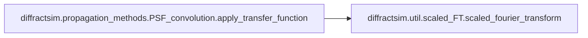
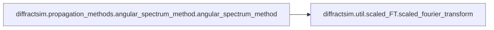

# Diffractsim Propagation Methods

[_Documentation generated by Documatic_](https://www.documatic.com)

<!---Documatic-section-Codebase Structure-start--->
## Codebase Structure

<!---Documatic-block-system_architecture-start--->

<!---Documatic-block-system_architecture-end--->

# #
<!---Documatic-section-Codebase Structure-end--->

<!---Documatic-section-diffractsim.propagation_methods.PSF_convolution.apply_transfer_function-start--->
## diffractsim.propagation_methods.PSF_convolution.apply_transfer_function

<!---Documatic-section-apply_transfer_function-start--->


### Object Calls

* [diffractsim.util.scaled_FT.scaled_fourier_transform](8-diffractsim_util.md#diffractsim.util.scaled_FT.scaled_fourier_transform)

<!---Documatic-block-diffractsim.propagation_methods.PSF_convolution.apply_transfer_function-start--->
<details>
	<summary><code>diffractsim.propagation_methods.PSF_convolution.apply_transfer_function</code> code snippet</summary>

```python
def apply_transfer_function(simulation, E, λ, H, scale_factor=1):
    global bd
    from ..util.backend_functions import backend as bd
    import matplotlib.pyplot as plt
    if scale_factor == 1:
        E_f = bd.fft.fftshift(bd.fft.fft2(E))
        return bd.fft.ifft2(bd.fft.ifftshift(E_f * H))
    else:
        fx = bd.fft.fftshift(bd.fft.fftfreq(simulation.Nx, d=simulation.x[1] - simulation.x[0]))
        fy = bd.fft.fftshift(bd.fft.fftfreq(simulation.Ny, d=simulation.y[1] - simulation.y[0]))
        (fxx, fyy) = bd.meshgrid(fx, fy)
        (nn_, mm_) = bd.meshgrid(bd.arange(simulation.Nx) - simulation.Nx // 2, bd.arange(simulation.Ny) - simulation.Ny // 2)
        factor = simulation.dx * simulation.dy * bd.exp(bd.pi * 1j * (nn_ + mm_))
        E_f = factor * bd.fft.fftshift(bd.fft.fft2(E))
        extent_fx = (fx[1] - fx[0]) * simulation.Nx
        (simulation.xx, simulation.yy, E) = scaled_fourier_transform(fxx, fyy, E_f * H, λ=-1, scale_factor=simulation.extent_x / extent_fx * scale_factor, mesh=True)
        simulation.x = simulation.x * scale_factor
        simulation.y = simulation.y * scale_factor
        simulation.dx = simulation.dx * scale_factor
        simulation.dy = simulation.dy * scale_factor
        simulation.extent_x = simulation.extent_x * scale_factor
        simulation.extent_y = simulation.extent_y * scale_factor
        return E
```
</details>
<!---Documatic-block-diffractsim.propagation_methods.PSF_convolution.apply_transfer_function-end--->
<!---Documatic-section-apply_transfer_function-end--->

# #
<!---Documatic-section-diffractsim.propagation_methods.PSF_convolution.apply_transfer_function-end--->

<!---Documatic-section-diffractsim.propagation_methods.angular_spectrum_method.angular_spectrum_method-start--->
## diffractsim.propagation_methods.angular_spectrum_method.angular_spectrum_method

<!---Documatic-section-angular_spectrum_method-start--->


### Object Calls

* [diffractsim.util.scaled_FT.scaled_fourier_transform](8-diffractsim_util.md#diffractsim.util.scaled_FT.scaled_fourier_transform)

<!---Documatic-block-diffractsim.propagation_methods.angular_spectrum_method.angular_spectrum_method-start--->
<details>
	<summary><code>diffractsim.propagation_methods.angular_spectrum_method.angular_spectrum_method</code> code snippet</summary>

```python
def angular_spectrum_method(simulation, E, z, λ, scale_factor=1):
    global bd
    from ..util.backend_functions import backend as bd
    fft_c = bd.fft.fft2(E)
    c = bd.fft.fftshift(fft_c)
    fx = bd.fft.fftshift(bd.fft.fftfreq(simulation.Nx, d=simulation.dx))
    fy = bd.fft.fftshift(bd.fft.fftfreq(simulation.Ny, d=simulation.dy))
    (fxx, fyy) = np.meshgrid(fx, fy)
    argument = (2 * bd.pi) ** 2 * ((1.0 / λ) ** 2 - fxx ** 2 - fyy ** 2)
    tmp = bd.sqrt(bd.abs(argument))
    kz = bd.where(argument >= 0, tmp, 1j * tmp)
    if scale_factor == 1:
        E = bd.fft.ifft2(bd.fft.ifftshift(c * bd.exp(1j * kz * z)))
    else:
        (nn_, mm_) = bd.meshgrid(bd.arange(simulation.Nx) - simulation.Nx // 2, bd.arange(simulation.Ny) - simulation.Ny // 2)
        factor = simulation.dx * simulation.dy * bd.exp(bd.pi * 1j * (nn_ + mm_))
        simulation.x = simulation.x * scale_factor
        simulation.y = simulation.y * scale_factor
        simulation.dx = simulation.dx * scale_factor
        simulation.dy = simulation.dy * scale_factor
        extent_fx = (fx[1] - fx[0]) * simulation.Nx
        (simulation.xx, simulation.yy, E) = scaled_fourier_transform(fxx, fyy, factor * c * bd.exp(1j * kz * z), λ=-1, scale_factor=simulation.extent_x / extent_fx * scale_factor, mesh=True)
        simulation.extent_x = simulation.extent_x * scale_factor
        simulation.extent_y = simulation.extent_y * scale_factor
    return E
```
</details>
<!---Documatic-block-diffractsim.propagation_methods.angular_spectrum_method.angular_spectrum_method-end--->
<!---Documatic-section-angular_spectrum_method-end--->

# #
<!---Documatic-section-diffractsim.propagation_methods.angular_spectrum_method.angular_spectrum_method-end--->

<!---Documatic-section-diffractsim.propagation_methods.two_steps_fresnel_method.two_steps_fresnel_method-start--->
## diffractsim.propagation_methods.two_steps_fresnel_method.two_steps_fresnel_method

<!---Documatic-section-two_steps_fresnel_method-start--->
<!---Documatic-block-diffractsim.propagation_methods.two_steps_fresnel_method.two_steps_fresnel_method-start--->
<details>
	<summary><code>diffractsim.propagation_methods.two_steps_fresnel_method.two_steps_fresnel_method</code> code snippet</summary>

```python
def two_steps_fresnel_method(simulation, E, z, λ, scale_factor):
    global bd
    from ..util.backend_functions import backend as bd
    L1 = simulation.extent_x
    L2 = simulation.extent_x * scale_factor
    fft_E = bd.fft.fftshift(bd.fft.fft2(E * np.exp(1j * np.pi / (z * λ) * (L1 - L2) / L1 * (simulation.xx ** 2 + simulation.yy ** 2))))
    fx = bd.fft.fftshift(bd.fft.fftfreq(simulation.Nx, d=simulation.dx))
    fy = bd.fft.fftshift(bd.fft.fftfreq(simulation.Ny, d=simulation.dy))
    (fx, fy) = bd.meshgrid(fx, fy)
    E = bd.fft.ifft2(bd.fft.ifftshift(bd.exp(-1j * np.pi * λ * z * L1 / L2 * (fx ** 2 + fy ** 2)) * fft_E))
    simulation.extent_x = simulation.extent_x * scale_factor
    simulation.extent_y = simulation.extent_y * scale_factor
    simulation.dx = simulation.dx * scale_factor
    simulation.dy = simulation.dy * scale_factor
    simulation.x = simulation.x * scale_factor
    simulation.y = simulation.y * scale_factor
    simulation.xx = simulation.xx * scale_factor
    simulation.yy = simulation.yy * scale_factor
    E = L1 / L2 * bd.exp(1j * 2 * np.pi / λ * z - 1j * np.pi / (z * λ) * (L1 - L2) / L2 * (simulation.xx ** 2 + simulation.yy ** 2)) * E
    return E
```
</details>
<!---Documatic-block-diffractsim.propagation_methods.two_steps_fresnel_method.two_steps_fresnel_method-end--->
<!---Documatic-section-two_steps_fresnel_method-end--->

# #
<!---Documatic-section-diffractsim.propagation_methods.two_steps_fresnel_method.two_steps_fresnel_method-end--->

[_Documentation generated by Documatic_](https://www.documatic.com)